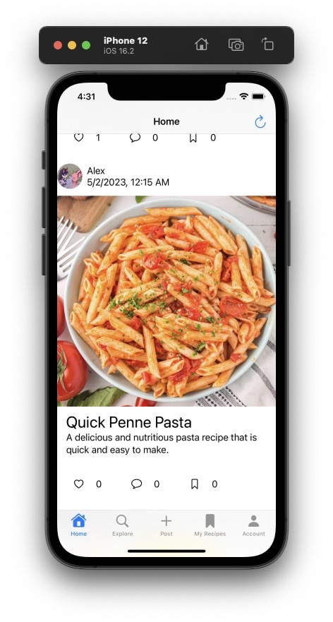
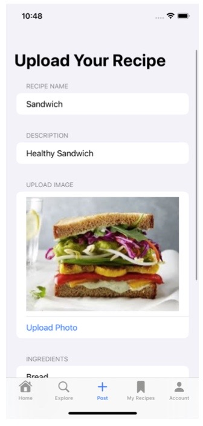
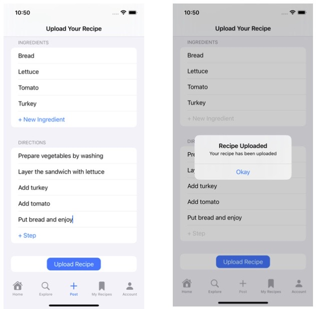
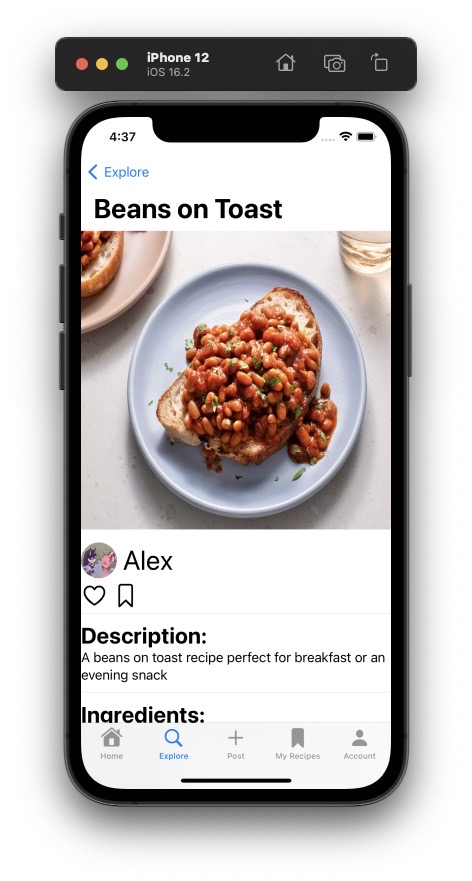
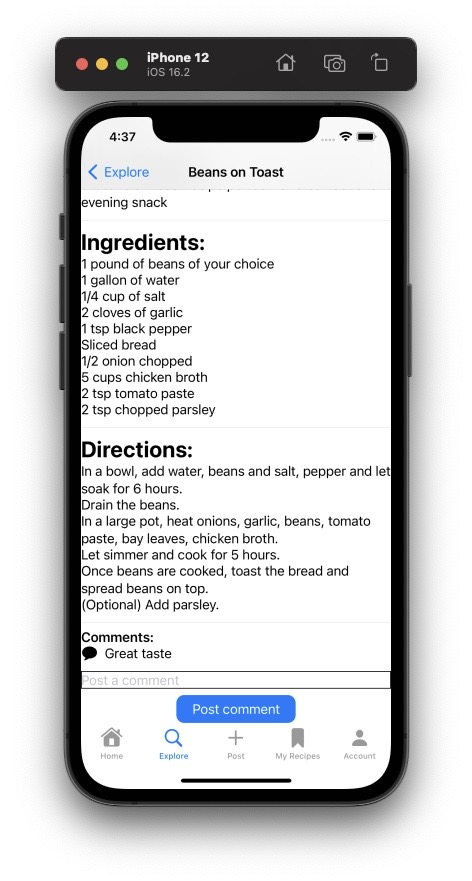
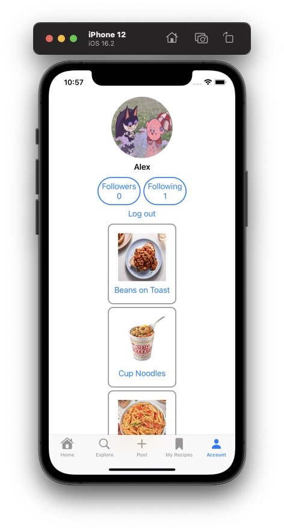

# Overview

A recipe app that allows users to easily find recipes of their liking. This can be done by searching for user’s recipes or scrolling through an updated feed on your home page.
To enhance user engagement, the app allows users to create accounts and interact with other users. This can be done by leaving comments on recipes, sharing recipes with friends, or creating and sharing their own recipes. 
Users can also save their favorite recipes for future reference. 
Overall, the recipe app is a comprehensive platform that allows users to easily find, create, and share recipes, while also engaging with a community of other food enthusiasts.

# Goals

The goal of this app is to have a fully functional system where users can create an account with the ability to freely explore and create recipes. 
Users should be able to like and save recipes if they want to use a recipe in the future.

# User Accounts

When first accessing the app, the user should be able to log in or create an account to be used. For a first-time user, they can create an account where they can input their email address, username, and password to be saved within the database. 
For incorrect text in such input fields, error messages are displayed for example if an incorrect username or password is found. 
The system has been built for such edge cases to ensure correct user authorization. Once an account is created, they can freely access the app with the ability to log in and log out at any point.

# Home Feed

The home page shows a scrollable feed of different users’ recipes which contains the information of that user’s username, date of posting, pictures of the dish, name of the recipe, descriptions, 
and an interactable bar beneath each recipe card which has buttons for liking, commenting, and bookmarking. 
At any point, the user can click on a recipe which navigates them to that recipe’s card with further information and details for such dish. 
Furthermore, the home feed has a refresh system where the button on the upper-right corner allows the user to refresh the home feed pulling all the latest recipes from the database.

# Explore/Search Function

An Explore tab/page allows the user to find other user’s recipes. 
Once found, the user can click on the searched item which navigates to such recipe’s card which contains information such as the username, name of recipe, description, likes and bookmarks, ingredients, directions, and a
comment section at the bottom showcasing comments from other users. Likewise, the current user can post their own comments for that recipe as well, which enhances the social ecosystem for the app’s community.

# Posting a Recipe

One of the most important functions of the app is the ability for the user to post their own recipe. 
Clicking the middle post tab in the app navigates the user to a page where they can upload their recipe. 
This acts as a form where the user can input the fields such as recipe name, description, uploading any images that access them to their phone’s photo library, list of ingredients, and directions. 
Once a recipe has been submitted it will be saved in the database where other users can see it as well either on their home or explore page.

# Social Metrics - Liking, Followers, Following, Comments

To build a social network for the app, there are features that promote social interaction between users. 
A user can like any recipe by clicking the heart button, where that recipe’s like metric will be incremented by 1 in the database. 
Furthermore, you can follow other users by clicking directly on another’s username which will then display that user's followers and following number. 
Commenting is another method of communicating, for each recipe, the user can make a comment whether they love it, hate it, or have any critiques.

# Saving/Bookmarking Recipes

The My Recipes tab allows the user to revisit any of the recipes that they have bookmarked. 
While scrolling through a feed that may eventually contain endless amounts of recipes, being able to bookmark the ones you are interested in will be a huge help compared to trying to backtrack and search for them. 
The saved recipes will be displayed in a list format where you can select any one and navigate to that recipe’s card, detailing all of that recipe’s information.

# Account Information
The Account tab contains your account information displaying your profile picture, followers, following, and a logout button. 
Like other applications, the account tab is a gateway to all of your account information which can in the future have additional features such as changing passwords, changing profile pictures, privacy & notification settings, etc.

